<!-- Terminal-style profile: typing ASCII portrait + Osmoti-forward neofetch card + live heatmap.
     Portrait:  python scripts/prep_photo.py source-photo.png && python scripts/make_ascii_svg.py
     Info card: python scripts/make_info_card.py
     Heatmap:   python scripts/fetch_contributions.py && python scripts/render_heatmap_svg.py
     Daily refresh: .github/workflows/update-profile-art.yml -->

<h3><code>rahul@github ~ $ whoami</code></h3>

<table>
<tr>
<td valign="top"></td>
<td valign="top"></td>
</tr>
</table>

 
 

<h3><code>rahul@github ~ $ cat ~/impact.txt</code></h3>

| | | | |
|:---:|:---:|:---:|:---:|
| **$3M+** | **$100K** | **5K+** | **8** |
| efficiency impact | hotel partnership | AI users reached | production prompts audited |

 

<h3><code>rahul@github ~ $ cat ~/osmoti.md</code></h3>

### Osmoti — Autonomous Marketing Department

Co-Founder &amp; CTO building [Osmoti](https://osmoti.com): an **autonomous marketing department** for local businesses — the growth layer that runs **iMessage + multi-channel** acquisition (ads, social, search, reviews, follow-up), answers leads in seconds, books work, and attributes every dollar to what produced it.

Paste a site once → brand kit, creatives, campaigns, and follow-up agents share context so each channel makes the others better.

**→** [osmoti.com](https://osmoti.com) · [app.osmoti.com](https://app.osmoti.com)

 

<h3><code>rahul@github ~ $ ls ~/ships/</code></h3>

| Ship | What it is |
|------|------------|
| [Osmoti](https://osmoti.com) | Autonomous marketing dept — Co-Founder & CTO |
| [Keep Safe / Beach Box](https://beachbox.co) | Hotel tech · **$100K** partnership secured |
| Manhattan Associates R&amp;D | Production **agent evaluation** infrastructure |
| Southwire AI | Enterprise analytics · **$3M+** efficiency impact |
| [Smart-Legal-Contracts](https://github.com/rahulmehta25/Smart-Legal-Contracts) | Arbitration-clause RAG · Harvard **NCRC 2025** |
| [analytics-pro](https://github.com/rahulmehta25/analytics-pro) | NL marketing analytics on BigQuery |
| [MARA](https://github.com/rahulmehta25/MARA) | Multi-agent research assistant (LangGraph) |
| [MARTA](https://github.com/rahulmehta25/MARTA) | Transit demand forecasting (XGBoost / LSTM) |

 

<h3><code>rahul@github ~ $ ./contributions.sh</code></h3>

 
 

<h3><code>rahul@github ~ $ ./links.sh</code></h3>

<b>Co-Founder &amp; CTO @ Osmoti · AI Systems Engineer · Georgia Tech DS '27</b>

 

